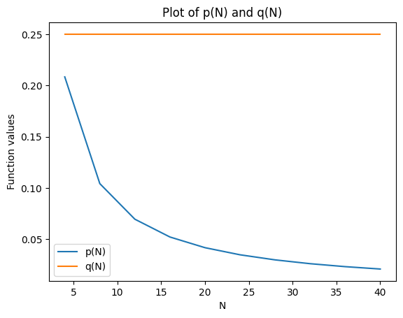

```python
# import all common packages
import pandas as pd
import numpy as np
# import matplotlib.pyplot as plt
import math
import os
import sys
```


```python
def funA(x):
    print("A", end=' ')
    return 2*x

def funB( y ):
    print("B", end=' ')
    return funA( y ) + 1

result = funB(2 + funA(1))
```

    A B A 


```python
def sum_odd_digits(number):
    #TODO: implement this function
    strs = str(number)
    sum = 0
    for i in strs:
        if int(i) % 2 != 0:
            sum += int(i)
    return sum

def sum_even_digits(number):
    #TODO: implement this function
    strs = str(number)
    sum = 0
    for i in strs:
        if int(i) % 2 == 0:
            sum += int(i)
    return sum

def sum_all_digits(number):
    #TODO: implement this function
    strs = str(number)
    sum = 0 
    for i in strs:
        sum += int(i)
    return sum
```


```python
# Consider the series

# total = 1/1 + 1/2 + 1/3 + 1/4 + 1/5 .... + 1/N
# What is the maximum number of terms added (i.e. the value of N) such that total < 5.0?

def check_series():
    total = 0
    n = 0
    while total < 5.0:
        n += 1
        total += 1 / n
    return n - 1

check_series()
```


    82


```python
# Write a function called is_increasing that takes a sequence (of numbers) and returns True iff the elements in the array are in (non-strict) increasing order. This means that every element is less than or equal to the next one after it. For example,

# for [1, 5, 9] the function should return True
# for [3, 3, 4] the function should return True
# for [3, 4, 2] the function should return False

def is_increasing(sequence):
    #TODO: implement this function
    return all(sequence[i] <= sequence[i+1] for i in range(len(sequence)-1))
```


```python
# Write a function most_average(numbers) which finds and returns the number in the input that is closest to the average of the numbers. (You can assume that the argument is a sequence of numbers.) By closest, we mean the one that has the smallest absolute difference from the average. You can use the built-in function abs to find the absolute value of a difference. For example, most_average([1, 2, 3, 4, 5]) should return 3 (the average of the numbers in the list is 3.0, and 3 is clearly closest to this). most_average([3, 4, 3, 1]) should also return 3 (the average is 2.75, and 3 is closer to 2.75 than is any other number in the list).


def most_average(numbers):
    #TODO: implement this function
    avg = sum(numbers)/len(numbers)
    diff = [abs(x-avg) for x in numbers]
    return numbers[diff.index(min(diff))]
```


```python
# Write two functions, smallest_greater(seq, value) and greatest_smaller(seq, value), that take as argument a sequence and a value, and find the smallest element in the sequence that is greater than the given value, and the greatest element in the sequence that is smaller than the given value, respectively.

# For example, if the sequence is [13, -3, 22, 14, 2, 18, 17, 6, 9] and the target value is 4, then the smallest greater element is 6 and the greatest smaller element is 2.

def smallest_greater(seq, value):
    #TODO: implement this function
    seqs = sorted(seq)
    for i in seqs:
        if i > value:
            return i


def greatest_smaller(seq, value):
    #TODO: implement this function
    seqs = sorted(seq, reverse=True)
    for i in seqs:
        if i < value:
            return i
```


```python
# If the same value appears more than once in a sequence, we say that all copies of it except the first are duplicates. For example, in [-1, 2, 4, 2, 0, 4], the second 2 and second 4 are duplicates; in the string "Immaterium", the 'm' is duplicated twice (but the 'i' is not a duplicate, because 'I' and 'i' are different characters).

def count_duplicates(seq):
    #TODO: implement this function
    count = 0
    for i in range(len(seq)):
        for j in range(i+1, len(seq)):
            if seq[i] == seq[j]:
                count += 1
                break 
    return count
```


```python
def count_in_bin(values, lower, upper):
    #TODO: implement this function
    count = 0
    for value in values:
        if lower < value <= upper:
            count += 1
    return count


# Write a function histogram(values, dividers) that takes as argument a sequence of values and a sequence of bin dividers, and returns the histogram as a sequence of a suitable type (say, an array) with the counts in each bin. The number of bins is the number of dividers + 1; the first bin has no lower limit and the last bin has no upper limit. As in (a), elements that are equal to one of the dividers are counted in the bin below.
def histogram(values, dividers):
    #TODO: implement this function
    counts = []
    for i in range(len(dividers) + 1):
        if i == 0:
            counts.append(count_in_bin(values, float('-inf'), dividers[i]))
        elif i == len(dividers):
            counts.append(count_in_bin(values, dividers[i-1], float('inf')))
        else:
            counts.append(count_in_bin(values, dividers[i-1], dividers[i]))
    return counts
```


```python
# In the unicode encoding system (which is used by python 3),  the string "Dog" is represented by the following sequence of numbers (character codes):

# 68,111,103


string = 'Dog'
print([ord(c) for c in string])

# ord to string
print(''.join([chr(c) for c in [86,101,114,121,32,72,97,114,100,32,69,120,97,109]]))
```

    [68, 111, 103]
    Very Hard Exam


```python
s = "problem"
s[1] + s[5] + s[6]
```


    'rem'


```python
def f(s):
    for elem1 in s:
        for elem2 in s[::-1]:
            if elem1 == elem2:
                return elem1
f("abcbdc")
```


    'a'


```python

'a way' < 'away'
```


    True


```python
len("1.5" + "1.5") == 3
```


    False


```python
def count_capitals(string):
    #TODO: implement this function
    cnt = 0
    for i in string:
        if i.isupper():
            cnt += 1
    return cnt

def count(seq, prop):
    cnt = 0
    for i in seq:
        if prop(i):
            cnt += 1
    return cnt
```


```python
def sum_odd_digits(number):
    dsum = 0 # digit sum
    strs = str(number)
    for i in strs:
        if int(i) % 2 != 0:
            dsum += int(i)
    return dsum

def sum_even_digits(number):
    dsum = 0 # digit sum
    strs = str(number)
    for i in strs:
        if int(i) % 2 == 0:
            dsum += int(i)
    return dsum

print(sum_odd_digits(12345))
print(sum_odd_digits(456789))
print(sum_even_digits(12345))
print(sum_even_digits(456789))

```

    9
    21
    6
    18


```python
def count_kmer(sequence, k):
    """ counting occurence
    of all distinct kmers"""
    distinct_kmers = {}
    result = []
    for index in range(len(sequence)-k+1):
        kmer = sequence[index:index+k]
        if kmer not in distinct_kmers:
            distinct_kmers[kmer] = 1
        else:
            distinct_kmers[kmer] += 1
    for key, value in distinct_kmers.items():
        result.append((key, value))
    return result

print (sorted(count_kmer("AGAGACCCCCT", 3)))
print (sorted(count_kmer("AGAGACCCCCT", 2)))
print (sorted(count_kmer("A", 1)))
print (sorted(count_kmer("A", 2)))
```

    [('ACC', 1), ('AGA', 2), ('CCC', 3), ('CCT', 1), ('GAC', 1), ('GAG', 1)]
    [('AC', 1), ('AG', 2), ('CC', 4), ('CT', 1), ('GA', 2)]
    [('A', 1)]
    []


```python
## a)
def caesar_shift(string, shift):
    #TODO: implement this function
    result = ""
    for s in string:
        if s.isalpha():
            if s.isupper():
                result += chr((ord(s) + shift - 65) % 26 + 65)
            else:
                result += chr((ord(s) + shift - 97) % 26 + 97)
        else:
            result += s
    return result

## b)
def decrypt_5(code):
    """Prints out the first 5 words decrypted using successively larger shifts
    """
    #TODO: implement this function
    # from -5 to -1
    for i in range(-5, 0):
        print(caesar_shift(code, i))
    pass

def decrypt_search(code):
    """Decrypt the message using increasing shift values whilst searching for 40 
    common three letter words. Return the shift value that gives the highest number 
    of different three letter words.
    """
    #TODO: implement this function
    # common words = [the,and,for,are,but,not,you,all,any,can, her,was,one,our,out,day,get,has,him,his, how,man,new,now,old,see,two,way,who,boy, did,its,let,put,say,she,too,use,dad,mom]
    common_word_list = ["the", "and", "for", "are", "but", "not", "you", "all", "any", "can", "her", "was", "one", "our", "out", "day", "get", "has", "him", "his", "how", "man", "new", "now", "old", "see", "two", "way", "who", "boy", "did", "its", "let", "put", "say", "she", "too", "use", "dad", "mom"]
    # Return the shift value that gives the highest number of different three letter words.
    countings = []
    for i in range(-26,26):
        result = caesar_shift(code, i)
        words = result.split()
        count_sum = {}
        for word in words:
            word = word.lower()
            if word in common_word_list:
                if word not in count_sum:
                    count_sum[word] = 1
                else:
                    count_sum[word] += 1
        # sord by value descending
        count_sum = sorted(count_sum.items(), key=lambda x: x[1], reverse=True)
        # sum up top 3
        top3 = 0
        for key, value in count_sum[:3]:
            top3 += value
        countings.append(top3)
        
    
    return 26 - countings.index(max(countings))
                   
    

    
def decrypt_find_e(code):
    """Decrypt Caesar ciphered message by finding most frequently occuring letter
    assume it is an "e" and return the corresponding shift.
    """
    #TODO: implement this function
    countings = []
    for i in range(-26,26):
        result = caesar_shift(code, i)
        count_e = 0
        for s in result:
            if s == "e" or s == "E":
                count_e += 1
        countings.append(count_e)
        
    
    return 26 - countings.index(max(countings))


## a)
print(caesar_shift("Et tu, Brutus!", 3))
print(caesar_shift("IBM", -1))
print(caesar_shift("COMP1730 is great!", 25))
print(caesar_shift("COMP1730 is great!", -25))
print(caesar_shift("uwu", -27))
print(caesar_shift("You Could Use Facts To Prove Anything That's Even Remotely True.", 29))

## b)
message1 = '''Awnhu pk neoa wjz awnhu pk xaz
              Iwgao w iwj dawhpdu, xqp okyewhhu zawz'''
message2 = '"Jcstghipcsxcv xh iwpi etctigpixcv fjpaxin du zcdlatsvt iwpi vgdlh ugdb iwtdgn, egprixrt, rdckxrixdc, phhtgixdc, tggdg pcs wjbxaxipixdc." (Gjat 7: Jht p rdadc puitg pc xcstetcstci rapjht id xcigdsjrt p axhi du epgixrjapgh, pc peedhxixkt, pc pbeaxuxrpixdc dg pc xaajhigpixkt fjdipixdc. Ugdb Higjcz & Lwxit, "Iwt Tatbtcih du Hinat".)'
message3 = "Cywo cmsoxdscdc gybu cy rkbn drobo sc xy dswo vopd pyb cobsyec drsxusxq. (kddbsledon dy Pbkxmsc Mbsmu)"
print(decrypt_search(message1))
print(decrypt_search(message2))
print(decrypt_search(message3))
print(decrypt_find_e(message1))
print(decrypt_find_e(message2))
```

    Hw wx, Euxwxv!
    HAL
    BNLO1730 hr fqdzs!
    DPNQ1730 jt hsfbu!
    tvt
    Brx Frxog Xvh Idfwv Wr Suryh Dqbwklqj Wkdw'v Hyhq Uhprwhob Wuxh.
    22
    15
    10
    18
    4


```python
# If a word begins with a vowel, append "yay" to the end of the word.

# If a word begins with a consonant, remove all the consonants from the beginning up to the first vowel and append them to the end of the word. Finally, append "ay" to the end of the word.

def to_pig_latin(string):
    #TODO: implement this function
    # if is not a word, return itself

    if not string.isalpha():
        return string
    
    result = ""
    
     # the initial consonant sound is transposed to the end of the word
    if string[0] not in "aeiou":
        for i in range(len(string)):
            if string[i] in "aeiou":
                result = string[i:] + string[:i] + "ay"
                break
    else:
        result = string + "yay"
    return result

print(to_pig_latin('dog'))
print(to_pig_latin('scratch'))
print(to_pig_latin('is'))
print(to_pig_latin('apple'))
print(to_pig_latin('1287643'))
```

    ogday
    atchscray
    isyay
    appleyay
    1287643


```python
# Given a function p(N) <= 5/(6*N), q(N) <= 1/4. N is from {4,8,12,16,20,24,28,32,36,40}. 
# Plot the function p(N) and q(N) in the same figure. Use different colors for the two functions and add a legend to the figure.

import matplotlib.pyplot as plt
import numpy as np

N = np.array([4, 8, 12, 16, 20, 24, 28, 32, 36, 40])

p = 5 / (6 * N)
q = 0.25 * np.ones(len(N))

plt.plot(N, p, label='p(N)')
plt.plot(N, q, label='q(N)')

plt.xlabel('N')
plt.ylabel('Function values')
plt.title('Plot of p(N) and q(N)')
plt.legend()

plt.show()
```


    

    


```python
max(1,6)
```


    6


```python
list1=[1,2,3,4,5]
list2=list1
list3=list2
list1.extend([6,7,8])
list2.reverse()
list3.remove(6)

list1
```


    [8, 7, 5, 4, 3, 2, 1]


```python
lsit = [(n*n) for n in range(1234) if (n*n)%2==0]
len(lsit) 
```


    617


```python
def perfect_shuffle_in_place(a_list):
    #TODO: implement this function
    perfect_list = a_list.copy()
    # split into two lists
    list1 = perfect_list[0:len(perfect_list)//2]
    list2 = perfect_list[len(perfect_list)//2:]
    # shuffle
    perfect_list = []
    for i in range(len(list1)):
        perfect_list.append(list1[i])
        perfect_list.append(list2[i])
    a_list[:] = perfect_list


def count_shuffles(a_list):
    #TODO: imeplement this function
    count = 0
    perfect_list = a_list.copy()
    while True:
        count += 1
        perfect_shuffle_in_place(perfect_list)
        if perfect_list == a_list:
            break
    return count
```


```python
def nesting_depth(a_list):
    #TODO: imeplement this function
    max_depth = 0
    for e in a_list:
        if type(e) == list:
            depth = nesting_depth(e)
            if depth > max_depth:
                max_depth = depth
    return max_depth 
```


```python
a_dict = { 'a' : ['a'],  'b' : ['b'] }
a_dict['a'] = a_dict.copy()
a_dict['c'] = a_dict
a_dict['a']['b'].append('c')
a_dict['c']['a']['b'] = []


a_dict['c']['b']
```


    ['b', 'c']


```python
import numpy as np

# 三个列向量，假设为 a, b, c
a = np.array([1, 2, 3])
b = np.array([4, 5, 6])
c = np.array([7, 8, 9])

# 构建 3x3 矩阵
matrix = np.column_stack((a, b, c))

# 使用叉乘和点乘计算行列式
determinant = np.dot(a, np.cross(b, c))
print("行列式的值为:", determinant)
```

    行列式的值为: 0


```python
def invert_dictionary(d):
    d_inv = {}
    for key, value in d.items():
        if value not in d_inv:
            d_inv[value] = key
        else:
            d_inv[value] = key
    return d_inv
```


```python
def invert_dictionary(d):
    d_inv = {}
    for key, value in d.items():
        if value not in d_inv:
            d_inv[value] = key
        else:
            d_inv[value] = key
    return d_inv
```


```python
def closed_sets(permutation):
    #TODO: implement this function
    checked = []
    result = []
    for key in permutation.keys():
        if key not in checked:
            current_res = [key]
            current_search = key
            while current_search in permutation.keys() and current_search not in current_res:
                checked.append(current_search)
                nextkey = permutation[current_search]
                current_res.append(nextkey)
                current_search = nextkey
            result.append(current_res)
    return result

p1 = { 'alice' : 'carol', 'bob' : 'bob', 'carol' : 'eve',
       'dave' : 'dave', 'eve' : 'alice' }
closed_sets(p1)
```


    [['alice'], ['bob'], ['carol'], ['dave'], ['eve']]


```python
def count_repetitions(string, substring):
    '''
    Count the number of repetitions of substring in string. Both
    arguments must be strings.
    '''
    return string.count(substring)
```


```python
print(count_repetitions("aabsabs","abs"))
```

    2


```python
def remove_substring_everywhere(string, substring):
    '''
    Remove all occurrences of substring from string, and return
    the resulting string. Both arguments must be strings.
    '''
    return string.replace(substring, "")
```


```python
print(remove_substring_everywhere("aabsabs","abs"))
```

    a


```python

def funA(alist):
    if len(alist) == 0:
        return alist
    else:
        return funA(alist[1:]) + [alist[0]]

def funB(alist):
    if len(alist) > 0:
        x = alist.pop(-1)
        alist = funB(alist)
        alist.insert(0,x)
    return alist

a = [1,2,3]
b = funB(a)
c = funA(a)
print(a,b,c)
```

    [3, 2, 1] [3, 2, 1] [1, 2, 3]


```python
def f(x):
    print(y)
    if y < 1:
        z = 1
        return x ** z
    else:
        return x ** y

y = 2
print(f(2))
```

    2
    4


```python
def f(x):
    global y
    print(y)
    if y < 1:
        y = 1
    return x ** y

y = 2
print(f(2))
```

    2
    4


```python
example_set = ["a", "b", "d","a", "b", "c", "d", "a", "b", "c", "d"]

def is_trending(left, right):
    # left < right , min to max increasing 
    # left > right , max to min decreasing
    return left < right

def is_same_element(left, right):
    return str(left) == str(right)

def find_trending_group(eg_set):
    results = []
    current = []
    for i in range(len(eg_set)):
        if i+1 < len(eg_set) and is_trending(eg_set[i], eg_set[i+1]):
            current.append(eg_set[i])
        else:
            current.append(eg_set[i])
            results.append(current)
            current = []
    # results.append(current)
    return results

def find_longest_result(results):
    lens = [len(x) for x in results]
    return results[lens.index(max(lens))]

def find_same_result(results):
    counter = {}
    for result in results:
        if str(result) not in counter.keys():
            counter[str(result)] = 0
        counter[str(result)] += 1
    return counter

results = find_trending_group(example_set)
find_longest_result(results)
# find_same_result(results)
```


    ['a', 'b', 'c', 'd']


```python
example_set = [1,5,2,4,7,2]
results = find_trending_group(example_set)
find_longest_result(results)
```


    [2, 4, 7]


```python
x = 1
y = -3
def funA( y ):
    if x >= 0:
        return y
    else:
        return -y

def funB( x ):
    return x * funA( y ) # y * y_ 

funB(y)
```


    9


```python
test_list = [1,2,2,4,5,5,5]

test_list[1:]
```


    [2, 2, 4, 5, 5, 5]


```python
eg_list = [1,2,3,4,6,89,9,643,100,343]

# get min to max
eg_list_sort = eg_list.copy()
eg_list_sort.sort()


# get max to min
eg_list_sort_res = eg_list.copy()
eg_list_sort_res.sort(reverse=True)

eg_list_sort
```


    [1, 2, 3, 4, 6, 9, 89, 100, 343, 643]


```python
x_in = [1,2,3,4,5,6,7,8,9,10]

x_in[-1], x_in[1]
```


    (10, 2)


```python
def find_max(x):
    x.sort()
    return x[-1] - x[0]

print("The max difference is ", find_max(x_in))
```

    The max difference is  9


```python
eg_dict = {
    "a": "b",
    "b": "e",
    "c": "f"
}

# O(n)
def count_ele_in_list(input_list):
    counter = {}
    for ele in input_list:
        if ele not in counter.keys():
            counter[ele] = 0
        counter[ele] += 1
    return counter

def is_invertable(dict):
    values = dict.values()
    
    counter = count_ele_in_list(values)

    for count in counter.values():
        if count > 1:
            return False
    return True

def invert_dict(dict):
    if not is_invertable(dict):
        return None
    keys = list(dict.keys())
    values = list(dict.values())

    results = {}
    for i in range(len(keys)):
        results[values[i]] = keys[i]
    return results

# is_invertable(eg_dict)
invert_dict(eg_dict)
```


    {'b': 'a', 'e': 'b', 'f': 'c'}


```python
eg_list = [1,2,3,4,6,89,9,643,100,343]


limit_level = 105

# max ele that is not greater than limit_level.
def bst_search(eg_list, min_index, max_index, limit_level):
    if min_index >= max_index:
        return min_index
    mid_index = (min_index + max_index) // 2
    if eg_list[mid_index] == limit_level:
        return mid_index
    elif eg_list[mid_index] > limit_level:
        return bst_search(eg_list, min_index, mid_index-1, limit_level)
    else:
        return bst_search(eg_list, mid_index+1, max_index, limit_level)

eg_list_used = eg_list.copy()
eg_list_used.sort()
print(eg_list_used)
limit_index = bst_search(eg_list_used, 0, len(eg_list_used), limit_level)
eg_list_used[limit_index]
```

    [1, 2, 3, 4, 6, 9, 89, 100, 343, 643]


    100


```python
# heap sort
def heapify(arr, n, i):
    largest = i
    l = 2 * i + 1
    r = 2 * i + 2
 
    if l < n and arr[i] < arr[l]:
        largest = l
 
    if r < n and arr[largest] < arr[r]:
        largest = r
 
    if largest != i:
        arr[i],arr[largest] = arr[largest],arr[i]
 
        heapify(arr, n, largest)

def heap_sort(arr):
    n = len(arr)
 
    for i in range(n//2 - 1, -1, -1):
        heapify(arr, n, i)
 
    for i in range(n-1, 0, -1):
        arr[i], arr[0] = arr[0], arr[i] 
        heapify(arr, i, 0)
    
    return arr

heap_sort(eg_list)

# get the max k elements
def get_max_k_elements(arr, k):
    n = len(arr)
 
    for i in range(n//2 - 1, -1, -1):
        heapify(arr, n, i)
 
    for i in range(n-1, n-k-1, -1):
        arr[i], arr[0] = arr[0], arr[i] 
        heapify(arr, i, 0)
    
    return arr[n-k:]
```


```python
eg_list = [1,2,3,4,6,89,9,643,100,343]

def is_better_trending(new_ele, temp_ele):
    # new_ele > temp_ele -> max
    # new_ele < temp_ele -> min
    return new_ele > temp_ele

# O(n)
# get trending element index
def get_trending_position(input_list):
    largest_index = 0
    temp_largest = input_list[largest_index]
    for i in range(len(input_list)):
        if is_better_trending(input_list[i], temp_largest):
            temp_largest = input_list[i]
            largest_index = i
    return largest_index

list_used = eg_list.copy()

lg = get_trending_position(list_used)
lg_ele = list_used.pop(lg)

lg2 = get_trending_position(list_used)
print(lg_ele, list_used[lg2])
```

    643 343


```python
eg_string = "hello overONE 12 hh3"

def fetch_letter_only(str_input):
    str_arr = str_input.split()
    result = []
    for strs in str_arr:
        current_str = ""
        for s in strs:
            if s.isalpha():
                current_str += s
        if current_str != "":
            result.append(current_str)
    return result

fetch_letter_only(eg_string)
```


    ['hello', 'overONE', 'hh']


```python
eg_list = [13.0, 9.6, 14.2, 17.5, 8.9, 9.7, 15.7, 20.4, 14.8, 13.2, 13.6, 15.6, 17.9, 24.1, 19.2]

search_area = [-1,0,1]
peak_area = 1

def get_peak_ele(eg_list, search_area, peak_area):
    results = []
    for i in range(len(eg_list)):
        neibour_area = search_area.copy()
        neibour_area.pop(peak_area)

        peak_ele = eg_list[i]
        neibour_area_ele = []
        for j in neibour_area:
            if i+j >= 0 and i+j < len(eg_list):
                neibour_area_ele.append(eg_list[i+j])
        
        # eak_ele > max(neibour_area_ele) -> max
        # eak_ele < max(neibour_area_ele) -> min
        if peak_ele > max(neibour_area_ele):
            results.append(peak_ele)
    return results


get_peak_ele(eg_list, search_area, peak_area)

```


    [13.0, 17.5, 20.4, 24.1]


```python
egs = ['honestness', 'honestly', 'dishonest', 'fairly']
k = 6


def most_common_substr(strings, k):
    substrs = []
    for string in strings:
        for i in range(len(string)-k+1):
            substrs.append(string[i:i+k])
    counter = count_ele_in_list(substrs)
    return get_max_pair_in_dict(counter)

def get_max_pair_in_dict(dict):
    if dict == {}:
        return [], 0
    
    max_value = max(dict.values())
    return [key for key, value in dict.items() if value == max_value][0], max_value

def find_common_solu(strings):
    results = []

    k = 1
    while True:
        string, time = most_common_substr(strings, k)
        if time > 1:
            results.append((string, time))
            k += 1
        else:
            break
    return results

soul = find_common_solu(egs)
print("Soul", soul)
soul[-1][1]
```

    Soul [('s', 6), ('ne', 4), ('nes', 4), ('hone', 3), ('hones', 3), ('honest', 3)]


    3


```python
eg_list = [1,2,3,4,4,5,7,8,9,4,4,4]

# by index
eg_list.pop(0)

# by value
eg_list.remove(4)
eg_list.remove(4)
eg_list.remove(4)
eg_list.remove(4)
eg_list.remove(4)

# by value
eg_list.append(4)
eg_list.insert(0, 5)

eg_list
```


    [5, 2, 3, 5, 7, 8, 9, 4]


```python
eg_list = [1,2,3,4,4,5,7,8,9,4,4,4]

def remove_all(list_input, ele):
    new_list = []
    for eles in list_input:
        if eles == ele:
            continue
        new_list.append(eles)
    return new_list

remove_all(eg_list, 4)
```


    [1, 2, 3, 5, 7, 8, 9]


```python
def unnest(alist):
    result = []
    for ele in alist:
        # if type(ele) == list:
        #     result += unnest(ele)
        # else:
        #     result.append(ele)
        result += unnest(ele) if type(ele) == list else [ele]
    return result
 
 
def test_unnest():
    """
    This function runs a number of tests of the unnest function.
    If it works ok, you will just see the output ("all tests passed") at
    the end when you call this function; if some test fails, there will
    be an error message.
    """
    
    assert unnest([2, 1, 3, [0, 4]]) == [2, 1, 3, 0, 4]
    assert unnest([1, [3], [2, 4], 0]) == [1, 3, 2, 4, 0]
    assert unnest([[[3, 0], 1], 4, 2]) == [3, 0, 1, 4, 2]
    assert unnest([1, [2], [[3], [[4], 5]]]) == [1, 2, 3, 4, 5]
    assert unnest([0, [[2, [1], 4]], [[3]]]) == [0, 2, 1, 4, 3]
    assert unnest([[[0], 2], 3, 1, 4]) == [0, 2, 3, 1, 4]
    assert unnest([[9, 5, 0, 4], [8, 7, 1], 6, 3, 2]) == [9, 5, 0, 4, 8, 7, 1, 6, 3, 2]
    assert unnest([6, 9, [2, 8, 7, 4], [[0, [5]], 1, 3]]) == [6, 9, 2, 8, 7, 4, 0, 5, 1, 3]
 
    assert unnest([[0], [[[2, 4, 3]], [1]]]) == [0, 2, 4, 3, 1]
    assert unnest([[4, [[1]]], 0, 2, 3]) == [4, 1, 0, 2, 3]
    assert unnest([[[1, 3, 4, [[[[2]]]]]], 0]) == [1, 3, 4, 2, 0]
    assert unnest([[4], 1, [[3, [0], [[2]]]]]) == [4, 1, 3, 0, 2]
    assert unnest([[[0]], 4, [[[3]]], [1, 2]]) == [0, 4, 3, 1, 2]
    assert unnest([7, [[5], [2], 4], 6, [[[0, [8], 1]], 9], [[3]]]) == [7, 5, 2, 4, 6, 0, 8, 1, 9, 3]
    assert unnest([[2, 6, [[[5]]], [7], 4, 9, 1, 0, 8], [[3]]]) == [2, 6, 5, 7, 4, 9, 1, 0, 8, 3]
    assert unnest([8, 6, 2, 1, 5, 7, 3, 9, [[[[[[[4]]]]]]], [0]]) == [8, 6, 2, 1, 5, 7, 3, 9, 4, 0]
    assert unnest([[4, [[[1]], 5, 2, 8, [[[3]], 0, 6]], 7, 9]]) == [4, 1, 5, 2, 8, 3, 0, 6, 7, 9]
    assert unnest([[[[1, 9], [3]], [2, [7, 5, 8], 6, 0]], 4]) == [1, 9, 3, 2, 7, 5, 8, 6, 0, 4]
 
    assert unnest([1, [], [2], [[3], [], [[4], [], 5]]]) == [1, 2, 3, 4, 5]
    assert unnest([1, [[3], []], [], [[], 2, 4], 0]) == [1, 3, 2, 4, 0]
    assert unnest([0, [[], [2, [1], 4]], [[], [3]]]) == [0, 2, 1, 4, 3]
    assert unnest([[], [[], [[], 3, 0], 1], [], 4, 2]) == [3, 0, 1, 4, 2]
    assert unnest([[[0], [], 2], [], [], 3, 1, [], 4]) == [0, 2, 3, 1, 4]
    assert unnest([2, [[]], 1, [3], [[0, 4]]]) == [2, 1, 3, 0, 4]
    assert unnest([[[]]]) == []
 
    print("all tests passed")

test_unnest()
```

    all tests passed


```python
 
# Implement the function count_dict_difference below.
# You can define other functions if it helps you decompose and solve
# the problem.
# Do not import any module that you do not use!
 
# Remember that if this were an exam problem, in order to be marked
# this file must meet certain requirements:
# - it must contain ONLY syntactically valid python code (any syntax
#   or indentation error that stops the file from running would result
#   in a mark of zero);
# - you MAY NOT use global variables; the function must use only the
#   input provided to it in its arguments.
 
def count_dict_difference(A, B):
    results = {}
    keys_of_B = B.keys()
    for key, value in A.items():
        if key not in keys_of_B:
            results[key] = value
        else:
            diff = value - B[key]
            if diff > 0:
                results[key] = value - B[key]
    return results
 
 
def test_count_dict_difference():
    """
    This function runs a number of tests of the count_dict_difference function.
    If it works ok, you will just see the output ("all tests passed") at
    the end when you call this function; if some test fails, there will
    be an error message.
    """
 
    assert count_dict_difference({'d': 3, 'e': 1, 'z': 1, 's': 1, 'i': 1, 'r': 1, 'a': 2, 'n': 1, 't': 1}, {'e': 2, 'x': 1, 'g': 1, 's': 1, 'p': 1, 'i': 1, 't': 1, 'a': 2, 'n': 1, 'r': 1}) == {'z': 1, 'd': 3}
    assert count_dict_difference({'m': 1, 'o': 1, 'c': 2, 'r': 1, 'i': 2, 't': 1, 'a': 2, 'n': 1, 'l': 2, 'u': 1}, {'m': 2, 'o': 2, 'c': 1, 'z': 1, 'a': 2, 'i': 5, 'u': 1, 'r': 2, 'n': 2, 's': 1, 't': 2}) == {'l': 2, 'c': 1}
    assert count_dict_difference({'g': 1, 'c': 1, 'a': 2, 'i': 2, 'u': 1, 'r': 1, 'n': 1, 'l': 1, 't': 2}, {'g': 1, 'c': 1, 's': 1, 'a': 2, 'i': 2, 't': 2, 'r': 2, 'l': 2, 'u': 2}) == {'n': 1}
    assert count_dict_difference({'o': 1, 's': 5, 'i': 2, 'a': 3, 'n': 2, 't': 1}, {'o': 1, 'c': 1, 'z': 1, 'i': 2, 't': 2, 'a': 3, 'n': 1, 'l': 1, 'u': 1}) == {'s': 5, 'n': 1}
    assert count_dict_difference({'o': 2, 'c': 1, 'e': 2, 's': 2, 'r': 2, 'n': 2, 't': 1}, {'d': 2, 'c': 1, 'e': 3, 'a': 1, 't': 1, 'r': 2, 'o': 2, 'v': 1}) == {'s': 2, 'n': 2}
    assert count_dict_difference({'e': 4, 'g': 2, 's': 5, 'a': 1, 'i': 1, 'r': 1, 'n': 1, 'v': 1}, {'o': 1, 'i': 1, 'g': 1, 'c': 2, 'e': 1, 'a': 2, 'k': 1, 'u': 1, 'r': 1, 'n': 2, 't': 3}) == {'s': 5, 'e': 3, 'g': 1, 'v': 1}
    
    assert count_dict_difference({0: 1, 17: 2, 2: 1, 19: 2, 4: 1, 8: 2, 18: 1, 13: 1, 14: 1, 15: 1}, {0: 2, 17: 1, 2: 1, 19: 2, 4: 1, 8: 2, 20: 1, 11: 1, 13: 1, 14: 1, 15: 1}) == {17: 1, 18: 1}
    assert count_dict_difference({0: 1, 17: 1, 18: 2, 19: 1, 4: 1, 8: 4, 11: 1, 12: 1}, {0: 1, 17: 2, 2: 1, 19: 1, 4: 2, 8: 1, 20: 1, 11: 2, 12: 1, 13: 1, 14: 1}) == {8: 3, 18: 2}
    assert count_dict_difference({0: 1, 17: 1, 18: 3, 3: 1, 4: 3, 6: 2, 13: 1}, {0: 2, 17: 1, 2: 1, 3: 1, 4: 1, 8: 1, 24: 1, 18: 1, 12: 1, 13: 1, 14: 1}) == {18: 2, 4: 2, 6: 2}
    assert count_dict_difference({0: 3, 3: 1, 4: 1, 6: 1, 11: 1, 13: 1, 14: 1, 18: 1, 19: 1, 20: 1, 21: 1, 24: 1}, {17: 1, 18: 1, 3: 1, 4: 2, 21: 1, 6: 1, 8: 1, 20: 1, 11: 1, 13: 1, 14: 1}) == {0: 3, 24: 1, 19: 1}
    assert count_dict_difference({17: 2, 2: 1, 3: 2, 4: 2, 13: 1, 18: 1, 14: 2, 15: 1}, {0: 1, 17: 2, 2: 1, 4: 2, 5: 1, 18: 1, 12: 1, 13: 3, 14: 2, 15: 1}) == {3: 2}
    assert count_dict_difference({0: 1, 18: 6, 4: 2, 11: 1, 12: 1, 13: 1}, {0: 1, 17: 1, 2: 1, 19: 1, 4: 2, 6: 1, 11: 1, 12: 1, 13: 1, 14: 2}) == {18: 6}
 
    assert count_dict_difference({'in': 1, 'ti': 1, 'iv': 1, 'se': 1, 've': 1, 'en': 1, 'ns': 2, 'it': 1, 'si': 1}, {'ve': 1, 'ti': 1, 'iv': 1, 'si': 1, 'it': 1, 'ns': 2, 'st': 1, 'ra': 1, 'tr': 1, 'in': 1, 'an': 1}) == {'se': 1, 'en': 1}
    assert count_dict_difference({'th': 1, 'gt': 1, 'le': 1, 'en': 2, 'ng': 1, 'he': 1, 'ed': 1, 'ne': 1}, {'th': 1, 'ed': 1, 'ng': 1, 'en': 2, 'gt': 1, 'st': 1, 'he': 1, 're': 1, 'tr': 1, 'ne': 1}) == {'le': 1}
    assert count_dict_difference({'sm': 2, 'ri': 1, 'me': 2, 'es': 1, 'is': 1, 'er': 1}, {'di': 1, 'er': 1, 'st': 1, 'is': 1, 're': 1, 'dn': 1, 'si': 1, 'ne': 1, 'in': 1, 'ed': 1, 'nt': 1, 'es': 3, 'se': 1, 'ss': 1, 'te': 2}) == {'me': 2, 'ri': 1, 'sm': 2}
    assert count_dict_difference({'iz': 1, 'on': 1, 'al': 1, 'ze': 1, 'li': 1, 'at': 1, 'na': 2, 'ti': 1, 'io': 1}, {'za': 1, 'ra': 1, 'on': 2, 'al': 1, 'li': 1, 'iz': 1, 'at': 2, 'na': 1, 'ti': 2, 'io': 2}) == {'ze': 1, 'na': 1}
 
    assert count_dict_difference({(0, 5, 6): 1, (0, 5): 1, (5, 5): 2, (5, 0): 1, (5, 6): 1, (5, 5, 0): 1, (6, 5, 5): 1, (5, 5, 5): 1, (6, 5): 1, (5, 6, 5): 1}, {(0, 5, 5): 1, (5, 5, 6): 1, (0, 5): 1, (5, 5): 2, (5, 0): 1, (5, 6): 1, (6, 5, 0): 1, (5, 5, 5): 1, (6, 5): 1, (5, 6, 5): 1}) == {(0, 5, 6): 1, (5, 5, 0): 1, (6, 5, 5): 1}
    assert count_dict_difference({(2, 0): 1, (7, 7, 7): 2, (8, 7): 1, (8, 7, 7): 1, (7, 2, 0): 1, (7, 7): 3, (7, 2): 1, (7, 7, 2): 1}, {(8, 7, 7): 1, (2, 0): 1, (7, 2, 0): 1, (8, 7): 1, (7, 8, 7): 1, (7, 7, 8): 1, (7, 8): 1, (7, 7): 2, (7, 2): 1, (7, 7, 2): 1}) == {(7, 7, 7): 2, (7, 7): 1}
    assert count_dict_difference({(8, 8, 5): 1, (0, 8, 8): 1, (8, 8): 1, (8, 5, 3): 1, (5, 3, 0): 1, (3, 0): 1, (3, 0, 8): 1, (0, 8): 2, (8, 5): 1, (5, 3): 1}, {(8, 8, 5): 1, (3, 0, 0): 1, (8, 8): 2, (8, 5, 3): 1, (5, 3, 0): 1, (3, 0): 1, (8, 8, 8): 1, (8, 5): 1, (0, 0): 1, (5, 3): 1}) == {(3, 0, 8): 1, (0, 8, 8): 1, (0, 8): 2}
    
    print("all tests passed")

test_count_dict_difference() 
```

    all tests passed


```python
 
# Implement the function approximate_integral below.
# (The statement "pass" is just a placeholder that does nothing: you
# should replace it.)
# You can define other functions if it helps you decompose and solve
# the problem.
# Do not import any module that you do not use!
 
# Remember that if this were an exam problem, in order to be marked
# this file must meet certain requirements:
# - it must contain ONLY syntactically valid python code (any syntax
#   or indentation error that stops the file from running would result
#   in a mark of zero);
# - you MAY NOT use global variables; the function must use only the
#   input provided to it in its arguments.
 
def approximate_integral(lower, upper, nterms):
    def f(x):
        return x**3
    
    area_sum = 0
    d = (upper - lower) / nterms
    for i in range(nterms):
        x = lower + i * d
        x_d = lower + (i+1) * d

        fx = f(x)
        fx_d = f(x_d)

        area_sum += (fx + fx_d) * d / 2
    
    return area_sum
 
 
def test_approximate_integral():
    """
    This function runs a number of tests of the approximate_integral function.
    If it works ok, you will just see the output ("all tests passed") at
    the end when you call this function; if some test fails, there will
    be an error message.
    """
    
    assert abs(approximate_integral(0, 1, 1) - 0.5) < 1e-6, 'sum of 0.5'
    assert abs(approximate_integral(1, 2, 1) - 4.5) < 1e-6, 'sum of 4.5'
    assert abs(approximate_integral(0, 2, 1) - 8.0) < 1e-6, 'sum of 8.0'
    assert abs(approximate_integral(0, 1, 2) - 0.3125) < 1e-6, 'sum of 0.03125, 0.28125'
    assert abs(approximate_integral(1, 2, 2) - 3.9375) < 1e-6, 'sum of 1.09375, 2.84375'
    assert abs(approximate_integral(0, 2, 2) - 5.0) < 1e-6, 'sum of 0.5, 4.5'
    assert abs(approximate_integral(0, 1, 5) - 0.26) < 1e-6, 'sum of 0.0008000000000000003, 0.007200000000000002, 0.028000000000000014, 0.07280000000000002, 0.1512'
    assert abs(approximate_integral(1, 2, 5) - 3.7799999999999994) < 1e-6, 'sum of 0.2728, 0.4472, 0.6839999999999998, 0.9927999999999998, 1.3831999999999995'
    assert abs(approximate_integral(0, 2, 5) - 4.16) < 1e-6, 'sum of 0.012800000000000004, 0.11520000000000004, 0.44800000000000023, 1.1648000000000003, 2.4192'
 
    assert abs(approximate_integral(-1, 0, 1) - -0.5) < 1e-6, 'sum of -0.5'
    assert abs(approximate_integral(-2, -1, 1) - -4.5) < 1e-6, 'sum of -4.5'
    assert abs(approximate_integral(-2, 0, 1) - -8.0) < 1e-6, 'sum of -8.0'
    assert abs(approximate_integral(-1, 0, 2) - -0.3125) < 1e-6, 'sum of -0.28125, -0.03125'
    assert abs(approximate_integral(-2, -1, 2) - -3.9375) < 1e-6, 'sum of -2.84375, -1.09375'
    assert abs(approximate_integral(-2, 0, 2) - -5.0) < 1e-6, 'sum of -4.5, -0.5'
    assert abs(approximate_integral(-1, 0, 5) - -0.260) < 1e-6, 'sum of -0.1512, -0.07280, -0.0280, -0.00720, -0.00080'
    assert abs(approximate_integral(-2, -1, 5) - -3.780) < 1e-6, 'sum of -1.38320, -0.99280, -0.6840, -0.44720, -0.27280'
    assert abs(approximate_integral(-2, 0, 5) - -4.160) < 1e-6, 'sum of -2.4192, -1.16480, -0.4480, -0.11520, -0.01280'
 
    assert abs(approximate_integral(-1, 1, 1) - 0.0) < 1e-6, 'sum of 0.0'
    assert abs(approximate_integral(-1, 1, 2) - 0.0) < 1e-6, 'sum of -0.5, 0.5'
    assert abs(approximate_integral(-1, 1, 4) - 0.0) < 1e-6, 'sum of -0.28125, -0.03125, 0.03125, 0.28125'
    assert abs(approximate_integral(-2, 2, 1) - 0.0) < 1e-6, 'sum of 0.0'
    assert abs(approximate_integral(-2, 2, 2) - 0.0) < 1e-6, 'sum of -8.0, 8.0'
    assert abs(approximate_integral(-2, 2, 4) - 0.0) < 1e-6, 'sum of -4.5, -0.5, 0.5, 4.5'
 
    print("all tests passed")

test_approximate_integral()
```

    all tests passed


```python
def interval_intersection(lA, uA, lB, uB):
    if uA < lB or uB < lA:
        return 0.0
    else:
        return min(uA, uB) - max(lA, lB)
 
 
def test_interval_intersection():
    """
    This function runs a number of tests of the interval_intersection function.
    If it works ok, you will just see the output ("all tests passed") at
    the end when you call this function; if some test fails, there will
    be an error message.
    """
 
    assert interval_intersection(0, 2, 4, 7.5) == 0.0, "no intersection (uA < lB)"
    assert interval_intersection(1, 3, 2.5, 6) == 0.5, "intersection is [2.5, 3]"
    assert interval_intersection(1, 3, 1.5, 5) == 1.5, "intersection is [1.5, 3]"
    assert interval_intersection(0, 2, -2, 1.5) == 1.5, "intersection is [0, 1.5]"
    assert interval_intersection(1, 3, 0, 3.5) == 2.0, "A is contained in B"
    assert interval_intersection(1.5, 3.5, 0, 3.5) == 2.0, "A is contained in B"
 
    print("all tests passed")

test_interval_intersection()
```

    all tests passed


```python
def super_increasing(seq):
    for i in range(1, len(seq)):
        if sum(seq[:i]) >= seq[i]:
            return False
    return True
 
 
def test_super_increasing():
    """
    This function runs a number of tests of the super_increasing function.
    If it works ok, you will just see the output ("all tests passed") at
    the end when you call this function; if some test fails, there will
    be an error message.
    """
 
    assert not super_increasing((1, 3, 5, 7, 19)), "sum(1, 3, 5) = 9 >= 7"
    assert super_increasing([1, 3, 5, 11, 21]), "sum(1) = 1 < 3; sum(1,3) = 4 < 5; sum(1, 3, 5) = 9 < 11; sum(1, 3, 5, 11) = 20 < 21"
    assert super_increasing((0, 1, 2, 4)), "sum(0) = 0 < 1; sum(0, 1) = 1 < 2; sum(0, 1, 2) = 3 < 4"
    assert not super_increasing([0, 0, 1, 2]), "sum(0) = 0 >= 0"
    assert super_increasing((-1, 0, 0, 1)), "sum(-1) = -1 < 0; sum(-1, 0) = -1 < 0; sum(-1, 0, 0) = -1 < 1"
    assert not super_increasing((1, 2, 0, 4)), "sum(1, 2) = 3 >= 0"
    assert super_increasing((-1, 3, 4)), "sum(-1) < 3; sum(-1, 3) = 2 < 4"
    assert not super_increasing((-1, 3, 4, 5)), "sum(-1, 3, 4) = 6 >= 5"
    assert super_increasing((-2, -1, -2)), "sum(-2) < -1; sum(-2, -1) = -3 < -2"
    assert not super_increasing((-2, -1, -4)), "sum(-2, -1) = -3 >= -4"
 
    print("all tests passed")

test_super_increasing()
```

    all tests passed


```python

# Implement the function moving_average below.
# You can define other functions if it helps you decompose and solve
# the problem.
# Do not import any module that you do not use!

# Remember that if this were an exam problem, in order to be marked
# this file must meet certain requirements:
# - it must contain ONLY syntactically valid python code (any syntax
#   or indentation error that stops the file from running would result
#   in a mark of zero);
# - you MAY NOT use global variables; the function must use only the
#   input provided to it in its arguments.

import numpy as np

def moving_average(seq, wsize):
    avg_results = []
    for i in range(len(seq) - wsize + 1):
        avg_results.append(np.mean(seq[i:i+wsize]))
    return avg_results


def seq_matches(seq1, seq2):
    """
    Return True if two sequences of numbers match with a tolerance of 0.001
    """
    if len(seq1) != len(seq2):
        return False
    for i in range(len(seq1)):
        if abs(seq1[i] - seq2[i]) > 1e-3:
            return False
    return True

def test_moving_average():
    """
    This function runs a number of tests of the moving_average function.
    If it works ok, you will just see the output ("all tests passed") at
    the end when you call this function; if some test fails, there will
    be an error message.
    """
    
    assert seq_matches(moving_average((-1, 0, 0, -2, 1), 2), (-0.5, 0.0, -1.0, -0.5))
    assert seq_matches(moving_average([-1, 0, 0, -2, 1], 3), (-0.334, -0.667, -0.334))
    assert seq_matches(moving_average(np.array([-1, 0, 0, -2, 1]), 4), (-0.75, -0.25))
    assert seq_matches(moving_average((0, 1, 2, 0, 2), 2), (0.5, 1.5, 1.0, 1.0))
    assert seq_matches(moving_average((0, 1, 2, 0, 2), 3), (1.0, 1.0, 1.333))
    assert seq_matches(moving_average((0, 1, 2, 0, 2), 4), (0.75, 1.25))

    assert seq_matches(moving_average((-0.4, -0.4, 1.2, -1.6, 1.2), 2), (-0.4, 0.4, -0.2, -0.2))
    assert seq_matches(moving_average((-0.4, -0.4, 1.2, -1.6, 1.2), 3), (0.133, -0.267, 0.266))
    assert seq_matches(moving_average((-0.4, -0.4, 1.2, -1.6, 1.2), 4), (-0.3, 0.1))
    assert seq_matches(moving_average((0.8, 2.0, 0.2, 1.0, 0.4), 2), (1.4, 1.1, 0.6, 0.7))
    assert seq_matches(moving_average((0.8, 2.0, 0.2, 1.0, 0.4), 3), (1.0, 1.066, 0.533))
    assert seq_matches(moving_average((0.8, 2.0, 0.2, 1.0, 0.4), 4), (1.0, 0.9))

    assert seq_matches(moving_average((-1.5, -4.0, -3.0, 3.5, 4.5, 0.0, -3.5, -0.5, 4.0, 0.5), 2), (-2.75, -3.5, 0.25, 4.0, 2.25, -1.75, -2.0, 1.75, 2.25))
    assert seq_matches(moving_average((-1.5, -4.0, -3.0, 3.5, 4.5, 0.0, -3.5, -0.5, 4.0, 0.5), 5), (-0.1, 0.2, 0.3, 0.8, 0.9, 0.1))
    assert seq_matches(moving_average((-1.5, -4.0, -3.0, 3.5, 4.5, 0.0, -3.5, -0.5, 4.0, 0.5), 8), (-0.563, 0.125, 0.687))
    assert seq_matches(moving_average((2.5, -1.0, 1.0, 3.5, -5.0, -0.5, 4.5, -5.0, 5.0, -3.5), 2), (0.75, 0.0, 2.25, -0.75, -2.75, 2.0, -0.25, 0.0, 0.75))
    assert seq_matches(moving_average((2.5, -1.0, 1.0, 3.5, -5.0, -0.5, 4.5, -5.0, 5.0, -3.5), 5), (0.2, -0.4, 0.7, -0.5, -0.2, 0.1))
    assert seq_matches(moving_average((2.5, -1.0, 1.0, 3.5, -5.0, -0.5, 4.5, -5.0, 5.0, -3.5), 8), (0.0, 0.312, 0.0))
    assert seq_matches(moving_average((2.5, -2.0, -2.5, 2.5, -0.5, -2.5, 0.5, -5.0, 4.5, -4.5, 3.0, 3.5, -4.0, 1.0, 5.0, 1.0, -1.0, 2.0, 4.0, -2.0), 2), (0.25, -2.25, 0.0, 1.0, -1.5, -1.0, -2.25, -0.25, 0.0, -0.75, 3.25, -0.25, -1.5, 3.0, 3.0, 0.0, 0.5, 3.0, 1.0))
    assert seq_matches(moving_average((2.5, -2.0, -2.5, 2.5, -0.5, -2.5, 0.5, -5.0, 4.5, -4.5, 3.0, 3.5, -4.0, 1.0, 5.0, 1.0, -1.0, 2.0, 4.0, -2.0), 5), (0.0, -1.0, -0.5, -1.0, -0.6, -1.4, -0.3, 0.3, 0.5, -0.2, 1.7, 1.3, 0.4, 1.6, 2.2, 0.8))
    assert seq_matches(moving_average((2.5, -2.0, -2.5, 2.5, -0.5, -2.5, 0.5, -5.0, 4.5, -4.5, 3.0, 3.5, -4.0, 1.0, 5.0, 1.0, -1.0, 2.0, 4.0, -2.0), 8), (-0.875, -0.625, -0.938, -0.25, -0.125, -0.563, -0.125, 0.437, 1.187, 0.5, 1.312, 1.437, 0.75))
    assert seq_matches(moving_average((2.5, -2.0, -2.5, 2.5, -0.5, -2.5, 0.5, -5.0, 4.5, -4.5, 3.0, 3.5, -4.0, 1.0, 5.0, 1.0, -1.0, 2.0, 4.0, -2.0), 13), (-0.347, -0.462, 0.076, 0.346, 0.076, 0.269, 0.769, 0.576))
    assert seq_matches(moving_average((-2.5, 3.5, 0.0, 3.5, 1.0, -2.5, -4.0, 1.5, -3.5, -3.0, 1.5, 0.0, 1.5, -3.5, -4.0, 3.5, 4.5, 2.5, 0.5, 0.5), 2), (0.5, 1.75, 1.75, 2.25, -0.75, -3.25, -1.25, -1.0, -3.25, -0.75, 0.75, 0.75, -1.0, -3.75, -0.25, 4.0, 3.5, 1.5, 0.5))
    assert seq_matches(moving_average((-2.5, 3.5, 0.0, 3.5, 1.0, -2.5, -4.0, 1.5, -3.5, -3.0, 1.5, 0.0, 1.5, -3.5, -4.0, 3.5, 4.5, 2.5, 0.5, 0.5), 5), (1.1, 1.1, -0.4, -0.1, -1.5, -2.3, -1.5, -0.7, -0.7, -0.7, -0.9, -0.5, 0.4, 0.6, 1.4, 2.3))
    assert seq_matches(moving_average((-2.5, 3.5, 0.0, 3.5, 1.0, -2.5, -4.0, 1.5, -3.5, -3.0, 1.5, 0.0, 1.5, -3.5, -4.0, 3.5, 4.5, 2.5, 0.5, 0.5), 8), (0.062, -0.063, -0.875, -0.688, -1.125, -1.063, -1.188, -1.188, -0.938, 0.062, 0.75, 0.625, 0.687))
    assert seq_matches(moving_average((-2.5, 3.5, 0.0, 3.5, 1.0, -2.5, -4.0, 1.5, -3.5, -3.0, 1.5, 0.0, 1.5, -3.5, -4.0, 3.5, 4.5, 2.5, 0.5, 0.5), 13), (-0.231, -0.308, -0.885, -0.616, -0.539, -0.424, -0.193, 0.153))

    print("all tests passed")


test_moving_average()

```

    all tests passed


```python
diag_one = np.diag(([1 for i in range(5)]))

diag_one
```


    array([[1, 0, 0, 0, 0],
           [0, 1, 0, 0, 0],
           [0, 0, 1, 0, 0],
           [0, 0, 0, 1, 0],
           [0, 0, 0, 0, 1]])


```python
import numpy as np

# Creating arrays
arr1 = np.array([1, 2, 3])  # 1D array
arr2 = np.array([[1, 2, 3], [4, 5, 6]])  # 2D array
arr3 = np.zeros((2, 3))  # 2x3 array of zeros
arr4 = np.ones((3, 2))  # 3x2 array of ones
arr5 = np.random.rand(2, 3)  # 2x3 array of random numbers between 0 and 1

# Array indexing and slicing
print(arr1[0])  # 1
print(arr2[1, 2])  # 6
print(arr2[:, 1:])  # [[2, 3], [5, 6]]

# Array operations
arr6 = np.array([1, 2, 3])
arr7 = np.array([4, 5, 6])
print(arr6 + arr7)  # [5, 7, 9]
print(arr6 * arr7)  # [4, 10, 18]
print(np.dot(arr6, arr7))  # 32

# Array functions
print(np.mean(arr5))  # mean of all elements
print(np.std(arr5))  # standard deviation of all elements
print(np.max(arr5))  # maximum value in the array
print(np.min(arr5))  # minimum value in the array
print(np.sum(arr5))  # sum of all elements in the array

# Reshaping arrays
arr8 = np.array([[1, 2], [3, 4], [5, 6]])
print(arr8.reshape(2, 3))  # [[1, 2, 3], [4, 5, 6]]

# Transposing arrays
print(arr8.T)  # [[1, 3, 5], [2, 4, 6]]

# Concatenating arrays
arr9 = np.array([[7, 8], [9, 10]])
print(np.concatenate((arr8, arr9), axis=0))  # [[ 1,  2], [ 3,  4], [ 5,  6], [ 7,  8], [ 9, 10]]
# print(np.concatenate((arr8, arr9), axis=1))  # [[ 1,  2,  7,  8], [ 3,  4,  9, 10], [ 5,  6,  0,  0]]

# Stacking arrays
# print(np.stack((arr8, arr9), axis=0))  # [[[ 1,  2], [ 3,  4], [ 5,  6]], [[ 7,  8], [ 9, 10]]]
# print(np.stack((arr8, arr9), axis=1))  # [[[ 1,  2], [ 7,  8]], [[ 3,  4], [ 9, 10]], [[ 5,  6], [ 0,  0]]]

# Splitting arrays
arr10 = np.array([1, 2, 3, 4, 5, 6])
print(np.split(arr10, 3))  # [array([1, 2]), array([3, 4]), array([5, 6])]

```

    1
    6
    [[2 3]
     [5 6]]
    [5 7 9]
    [ 4 10 18]
    32
    0.6451165107371377
    0.3208501817029448
    0.9845349292054701
    0.07490033695680598
    3.8706990644228263
    [[1 2 3]
     [4 5 6]]
    [[1 3 5]
     [2 4 6]]
    [[ 1  2]
     [ 3  4]
     [ 5  6]
     [ 7  8]
     [ 9 10]]
    [array([1, 2]), array([3, 4]), array([5, 6])]

